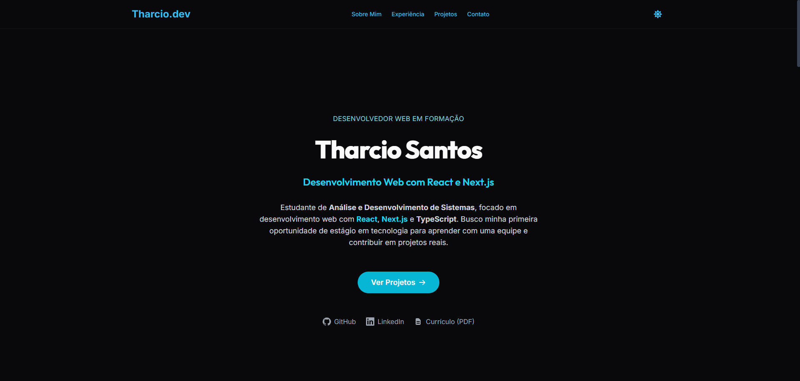

<div align="center">

# Tharcio Santos — Portfólio

Portfólio pessoal focado em aplicações web, projetos reais, processo de desenvolvimento, habilidades aplicadas e evolução incremental.

[Ver versão pública atual](https://tharcio-portfolio.vercel.app) · [LinkedIn](https://www.linkedin.com/in/tharcio-santos-dev/) · [Email](mailto:tharciosantos09@gmail.com)



</div>

---

## Sobre

Este projeto apresenta minha trajetória como estudante de Análise e Desenvolvimento de Sistemas e desenvolvedor Full Stack Júnior. O portfólio reúne aplicações publicadas, um produto em construção, habilidades demonstradas em contexto e o processo que uso para evoluir cada projeto.

A interface segue uma direção editorial de produto: hierarquia visual clara, leitura rápida, conteúdo organizado por evidências e uma paleta baseada em grafite, teal/ciano e superfícies neutras. Dark e light mode compartilham os mesmos tokens semânticos, com contraste, foco visível e estados interativos consistentes.

---

## Proposta Visual e Estrutura

- **Portfólio editorial de produto:** projetos apresentados por problema, solução, entrega e decisões técnicas.
- **HelpFlow como case principal:** aplicação mais completa, com autenticação, regras de negócio, banco relacional e deploy.
- **ManutFlow como produto em construção:** evolução documentada sem criar demonstrações ou resultados que ainda não existem.
- **Projetos secundários compactos:** DevLinks, Lista de Mercado e Crypto Dashboard aparecem como evidências complementares.
- **Processo visível:** seção "Como eu trabalho" apresenta o fluxo de análise, escopo, implementação, teste e revisão.
- **Habilidades aplicadas:** tecnologias organizadas por contexto de uso, em vez de uma lista genérica de ferramentas.

---

## O que este projeto demonstra

Mais do que uma vitrine, este repositório reúne práticas aplicadas em frontend e engenharia de software:

- **Arquitetura moderna:** Next.js 15 com App Router, componentes organizados por responsabilidade e dados compartilhados fora da interface quando apropriado.
- **Sistema de design próprio:** tokens semânticos no Tailwind para fundos, superfícies, textos, bordas e accent teal/ciano nos dois temas.
- **Componentização:** componentes reutilizáveis com React e TypeScript, como `Button`, `ProjectCard` e `Section`.
- **Conteúdo organizado:** projetos, habilidades, experiências e constantes vivem parcialmente em `src/data`; copies específicas de apresentação permanecem próximas das respectivas seções.
- **Acessibilidade e responsividade:** navegação por teclado, foco visível, atributos ARIA, menu mobile e layouts adaptados para diferentes larguras.
- **Interatividade controlada:** Navbar como Client Component para scroll spy, menu mobile e alternância de tema, sem animações pesadas.
- **Performance:** imagens otimizadas, ícones SVG locais, CSS crítico otimizado e Analytics carregado dinamicamente.
- **SEO técnico:** sitemap, `robots.txt`, Open Graph, Twitter Card e `themeColor` por preferência de tema.
- **Integração contínua:** GitHub Actions validando formatação, lint, tipos, testes e build.
- **Qualidade de código:** Vitest, Testing Library, ESLint, Prettier, Husky e lint-staged.

---

## Projetos

### Case principal — HelpFlow

Sistema de help desk Full Stack para abertura, acompanhamento e gerenciamento de chamados internos, com autenticação por sessão, controle de acesso, banco relacional e aplicação publicada.

- **Stack:** Next.js, React, JavaScript, Prisma, Supabase, PostgreSQL, NextAuth, Zod, Vitest, Cypress
- **Links:** [Aplicação](https://helpflow.vercel.app/) · [Código](https://github.com/tharciosantos/helpflow)

### Produto em construção — ManutFlow

Sistema em desenvolvimento para controle de equipamentos, ordens de manutenção, responsáveis, prioridades e histórico. A implementação atual inclui cadastro e gestão de equipamentos, ordens de serviço com controle de status, filtros, busca textual e dashboard com indicadores.

- **Stack:** Next.js, React, TypeScript, Tailwind CSS, Supabase, PostgreSQL
- **Link:** [Acompanhar no GitHub](https://github.com/tharciosantos/manutflow)

### Projetos secundários

#### DevLinks

Perfil personalizável com avatar, links dinâmicos, upload via Cloudinary, estado sincronizado com React Query e testes end-to-end com Cypress.

- **Stack:** React, Vite, JavaScript, Tailwind CSS, React Query, Cloudinary, Cypress, GitHub Actions
- **Links:** [Aplicação](https://devlinks-web-api.vercel.app/) · [Código](https://github.com/tharciosantos/devlinks-web) · [API](https://github.com/tharciosantos/devlinks-api)

#### Lista de Mercado

PWA mobile-first para organizar compras, com funcionamento offline, persistência local e compartilhamento pelo WhatsApp.

- **Stack:** React, Vite, PWA, Tailwind CSS, Local Storage
- **Links:** [Aplicação](https://lista-mercado-sage.vercel.app/) · [Código](https://github.com/tharciosantos/lista-mercado)

#### Crypto Dashboard

Dashboard para consulta de criptomoedas com busca, rotas dinâmicas, renderização client-side e tratamento de estados ao consumir a API da CoinGecko.

- **Stack:** Next.js, React, CoinGecko API
- **Links:** [Aplicação](https://crypto-dashboard-five-sandy.vercel.app/) · [Código](https://github.com/tharciosantos/crypto-dashboard)

---

## Seções do Portfólio

1. **Hero:** posicionamento profissional, objetivo e acesso aos projetos e currículo.
2. **Evidence Strip:** evidências técnicas resumidas para leitura rápida.
3. **Projetos:** HelpFlow, ManutFlow e projetos secundários.
4. **Processo:** fluxo incremental de estudo e desenvolvimento.
5. **Habilidades aplicadas:** interface, backend e dados, qualidade e entrega.
6. **Sobre:** formação, objetivo profissional e contexto profissional.
7. **Trajetória:** conexão entre experiências anteriores e desenvolvimento de software.
8. **Contato:** email, LinkedIn, GitHub e currículo.

---

## Tecnologias

### Core

- [Next.js](https://nextjs.org/) 15 — App Router, renderização, Image Optimization e OG images
- [React](https://react.dev/) 19.1
- [TypeScript](https://www.typescriptlang.org/) 5.7
- [Tailwind CSS](https://tailwindcss.com/) 3.4

### Interface e infraestrutura

- `class-variance-authority`, `clsx` e `tailwind-merge` — variantes e composição de classes.
- `next-themes` — suporte a tema claro, escuro e preferência do sistema.
- Ícones SVG locais — componentes reutilizáveis sem biblioteca externa de ícones.
- `@vercel/analytics` — métricas de uso carregadas dinamicamente.

### Qualidade e testes

- **Vitest** e **Testing Library** — testes unitários e comportamentais.
- **ESLint** e **Prettier** — análise estática e formatação.
- **Husky** e **lint-staged** — formatação automática no pre-commit.
- **GitHub Actions** — pipeline com formatação, lint, verificação de tipos, testes e build.

---

## Decisões Técnicas

- **Tokens de design no Tailwind:** cores semânticas como `accent`, `dark-bg`, `light-surface` e `border-light` centralizam a paleta grafite + teal/ciano e mantêm os temas consistentes.
- **Dados e interface:** informações reutilizadas por diferentes componentes ficam em `src/data`; textos editoriais específicos permanecem nos componentes das seções para manter contexto e legibilidade.
- **Sistema de componentes com CVA:** `Button` usa `class-variance-authority` com `tailwind-merge` para centralizar variantes e estados.
- **Navbar interativa:** a Navbar é um Client Component responsável pelo scroll spy e pela integração com o menu mobile e o alternador de tema.
- **Ícones SVG locais:** os ícones vivem em `src/app/components/ui/Icons.tsx`, reduzindo dependências.
- **CSS crítico otimizado:** o build usa `optimizeCss` com `critters` para reduzir bloqueios na renderização inicial.
- **Analytics dinâmico:** o Analytics da Vercel é isolado em um componente client carregado dinamicamente.
- **Testes comportamentais:** os testes usam `userEvent` para simular interações mais próximas do uso real.
- **CI:** GitHub Actions executa formatação, lint, TypeScript, testes e build antes da integração com `main`.
- **Pre-commit automático:** Husky e lint-staged executam o Prettier apenas nos arquivos staged.

---

## Estrutura de Pastas

```txt
meu-portfolio/
├── .github/workflows/       # Pipeline de CI
├── .husky/                  # Hooks de pre-commit
├── public/                  # Imagens, ícones, PDF e manifest
├── src/
│   ├── app/                 # App Router, páginas, layout e rotas auxiliares
│   │   ├── components/      # Navbar, Footer, seções e componentes de UI
│   │   └── hooks/           # Hooks customizados
│   ├── data/                # Projetos, habilidades, experiências e constantes
│   └── lib/                 # Funções utilitárias
└── vitest.setup.ts          # Configuração global dos testes
```

---

## Como Executar

### Pré-requisitos

- Node.js 18+
- npm

### Instalação

```bash
git clone https://github.com/tharciosantos/meu-portfolio.git
cd meu-portfolio
npm install
```

```bash
npm run dev
```

### Scripts Disponíveis

| Script                 | Descrição                                                                        |
| ---------------------- | -------------------------------------------------------------------------------- |
| `npm run dev`          | Inicia o servidor local de desenvolvimento.                                      |
| `npm run build`        | Compila a versão otimizada para produção.                                        |
| `npm start`            | Inicia o servidor com o build gerado.                                            |
| `npm run lint`         | Lista problemas de padronização com ESLint.                                      |
| `npm run lint:fix`     | Corrige problemas de lint automaticamente.                                       |
| `npm run format`       | Formata todos os arquivos via Prettier.                                          |
| `npm run format:check` | Verifica se todos os arquivos estão formatados corretamente (usado na pipeline). |
| `npm test`             | Executa os testes no modo watch.                                                 |
| `npm run test:run`     | Executa a suíte de testes uma única vez (ideal para CI).                         |
| `npm run test:watch`   | Executa os testes em modo interativo.                                            |

---

## Checklist Antes de Abrir PR

Antes de abrir um PR ou fazer merge, rode as validações locais:

```bash
npm run format:check
npm run lint
npx tsc --noEmit
npm run test:run
npm run build
npm audit --audit-level=moderate
```

Não use `npm audit fix --force` sem revisão, pois o npm pode sugerir mudanças incompatíveis com a stack atual.

---

## Autor

**Tharcio Santos**

- [LinkedIn](https://www.linkedin.com/in/tharcio-santos-dev/)
- [GitHub](https://github.com/tharciosantos)
- [Email](mailto:tharciosantos09@gmail.com)
- [Versão pública atual do portfólio](https://tharcio-portfolio.vercel.app/)
